# WindowTilingControl — Window Tiling Control for GNOME

**WindowTilingControl** (displayed as **Window Tiling Control** in the GNOME settings panel) is a GNOME Shell extension (45–49) that brings snap zone tiling to GNOME. It provides drag-to-edge snapping, a visual layout picker, snap groups, a custom zone editor, and full keyboard control — designed natively for the Linux desktop.

---

## Table of Contents

1. [Architecture Overview](#architecture-overview)
2. [Features](#features)
   - [Zone System & Layout Presets](#zone-system--layout-presets)
   - [Drag-to-Edge Snapping](#drag-to-edge-snapping)
   - [Snap Layout Overlay (Super+Z)](#snap-layout-overlay-superz)
   - [Snap Assist](#snap-assist)
   - [Snap Groups](#snap-groups)
   - [Zone Highlights](#zone-highlights)
   - [Custom Zone Editor](#custom-zone-editor)
   - [Maximize Button Hook](#maximize-button-hook)
   - [Keybindings](#keybindings)
   - [Multi-Monitor Support](#multi-monitor-support)
   - [Quick Settings Indicator](#quick-settings-indicator)
   - [Animations](#animations)
3. [Module Reference](#module-reference)
4. [Settings Reference](#settings-reference)
5. [Extension Lifecycle](#extension-lifecycle)
6. [Test Architecture](#test-architecture)
7. [Build & Install](#build--install)

---

## Architecture Overview

WindowTilingControl uses a **layered controller pattern**. A single `WindowTilingControlController` owns all subsystems and wires them together in a 13-phase enable sequence. Every subsystem is a self-contained class that connects to GNOME signals in `enable()` and cleans up in `disable()`.

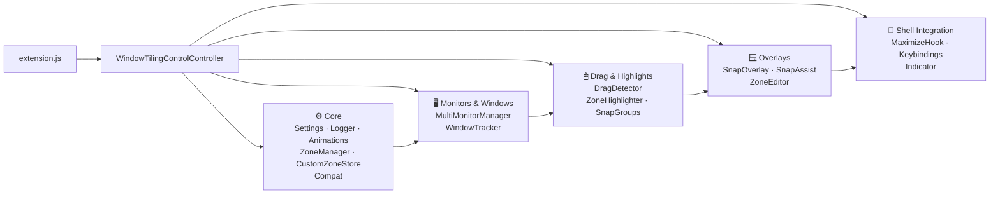

---

## Features

### Zone System & Layout Presets

**Module:** `src/layoutPresets.js` · `src/zoneManager.js` · `src/customZones.js`

Zone geometry is stored as **normalized rectangles** (`NormRect`) with `x, y, w, h` in the range 0.0–1.0. At runtime, `ZoneManager` converts them to pixel `Meta.Rectangle` values using the monitor workarea, applying a configurable gap on all four sides.

#### Built-in Presets

| ID | Label | Min. Aspect | Description |
|----|-------|-------------|-------------|
| `halves` | Halves | any | 50 / 50 left–right split |
| `thirds` | Thirds | 1.3 | Three equal columns |
| `wide-left` | Wide Left | any | 2/3 left + 1/3 right |
| `wide-right` | Wide Right | any | 1/3 left + 2/3 right |
| `quarters` | Quarters | any | 2×2 grid |
| `half-quarters` | Half + Quarters | any | Left half + two stacked right quarters |
| `sixths` | Sixths | 2.1 (ultra-wide) | 3×2 grid |
| `top-thirds` | Top Thirds | portrait only | Two top halves + full-width bottom |

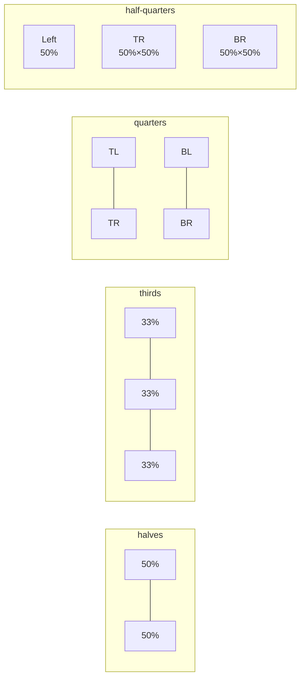

Presets are **filtered per monitor** by aspect ratio — ultra-wide presets like Sixths only appear on monitors wider than ~21:9.

#### Custom Zone Sets

Users can create arbitrary layouts through the Zone Editor. Each set is stored as a JSON string array in GSettings (`custom-zone-sets`). `CustomZoneStore` (a GObject subclass) emits a `"changed"` signal when sets are added, updated, or removed, so dependent UI rebuilds automatically.

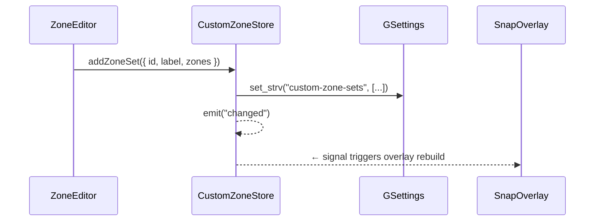

---

### Drag-to-Edge Snapping

**Module:** `src/dragDetector.js`

When a window is dragged (`Meta.GrabOp.MOVING`, `KEYBOARD_MOVING`, or `MOVING_UNCONSTRAINED`), `DragDetector` starts a **16 ms pointer-poll loop** using `GLib.timeout_add`. On each tick it calls `_getEdgeZone()` to check if the pointer is within the edge/corner threshold.

A **30-second safety timeout** limits the poll loop to prevent runaway polling if a `grab-op-end` signal is missed.

#### GNOME Version Compatibility

The `grab-op-begin` signal changed from 3 params `(display, window, grabOp)` in GNOME 45 to 2 params `(display, window)` in GNOME 46+. `DragDetector` handles this by falling back to `global.display.get_grab_op()` when the third param is undefined.

#### Edge Detection Strategy

Edge/corner proximity is detected against the **monitor geometry** (physical screen edge), but the resulting zone rectangles use the **workarea** (respecting panels/taskbars). This ensures drag-to-edge works even when the panel occupies part of the screen edge.

#### Detection Priority (corners beat edges)

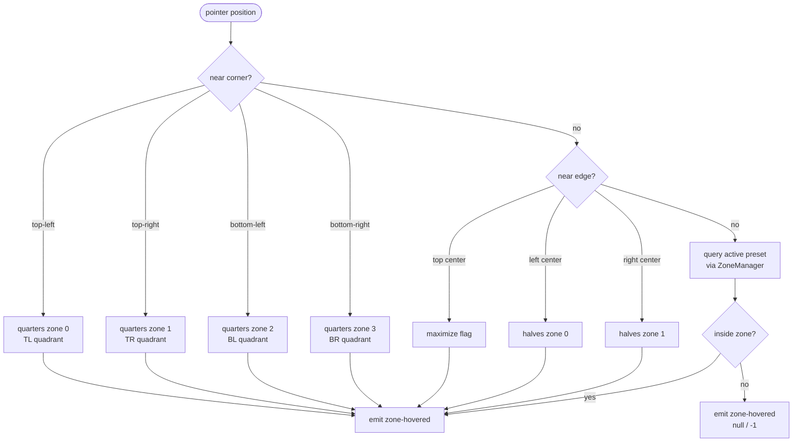

#### Signal Design

The `zone-hovered` and `zone-selected` GObject signals carry **only serializable params** (`presetId: string`, `monitorIndex: int`, `zoneIndex: int`). The full zone rect is exposed via the `hoveredZone` and `selectedZone` properties on the `DragDetector` instance — this avoids the GJS `GObject.TYPE_POINTER` marshalling crash that occurs when passing `Meta.Rectangle` through GObject signal params.

On drag end, `DragDetector` emits `"zone-selected"`. If the last hovered zone has `isMaximize = true`, the window is maximized directly via `win.maximize(Meta.MaximizeFlags.BOTH)`.

**Threshold clamped** to a minimum of 20 px to prevent accidental triggers.

---

### Snap Layout Overlay (Super+Z)

**Module:** `src/snapOverlay.js`

The overlay is a horizontal `St.BoxLayout` that appears at the top of the focused window's monitor (position configurable: `top-center` or `top-right`). It shows one button per available preset for that monitor's aspect ratio.

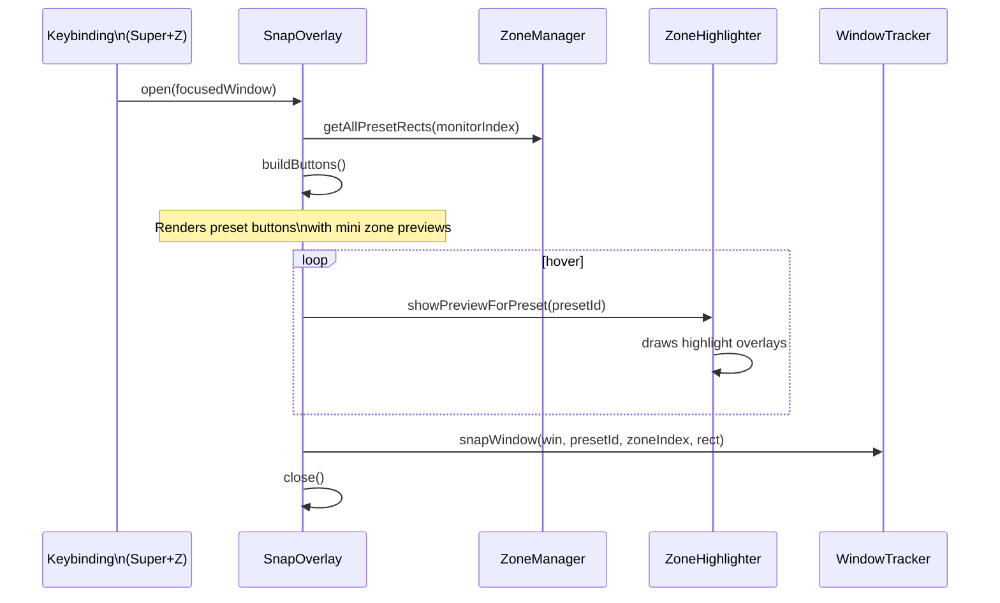

**Keyboard navigation:** arrow keys cycle buttons, Enter snaps, Escape dismisses. Click-outside-to-dismiss uses a captured event handler on `global.stage`.

---

### Snap Assist

**Module:** `src/snapAssist.js`

After a window is snapped to one zone of a multi-zone preset, Snap Assist shows a **thumbnail picker** over each remaining unfilled zone. Clicking a thumbnail snaps that window to the zone.

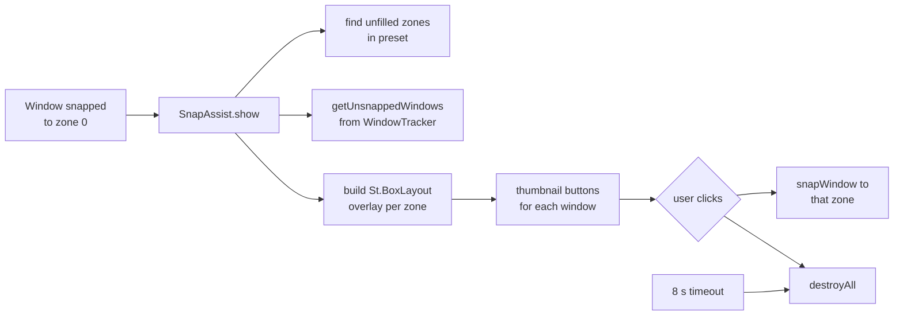

- Max 8 thumbnails per zone
- Auto-dismisses after `snap-assist-timeout` seconds (default 8)
- Rebuilds if the active workspace changes

---

### Snap Groups

**Module:** `src/snapGroups.js`

When two or more windows share the same preset + monitor + workspace, they form a **snap group**. `SnapGroupsManager` adds a panel button to the GNOME Shell status bar that lists all active groups and lets the user restore them with one click.

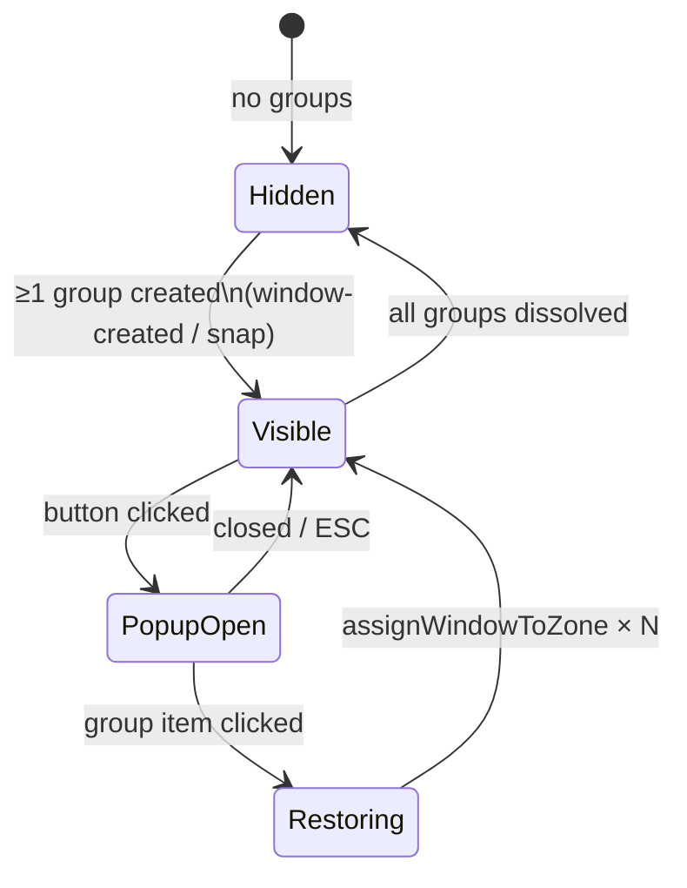

The panel button auto-refreshes on `active-workspace-changed`, `window-created`, and any direct `refresh()` call from `WindowTracker`.

Signal subscriptions are tracked separately per GObject source (`_displaySignalIds` for `global.display`, `_wmSignalIds` for `global.workspace_manager`) to ensure correct cleanup on `disable()`.

---

### Zone Highlights

**Module:** `src/zoneHighlight.js`

`ZoneHighlighter` renders semi-transparent `St.Bin` actors directly on `global.window_group`. This puts them above windows but below the shell chrome.

- **On drag hover:** highlights all zones of the active preset; tints the hovered zone differently.
- **On snap overlay hover:** previews all zones for the hovered preset button.
- **On drag release:** clears all highlights immediately.

Colors are driven by the `zone-highlight-color` (fill) and `zone-border-color` (border) settings.

---

### Custom Zone Editor

**Module:** `src/zoneEditor.js`

A full-screen, FancyZones-style visual editor that opens over the selected monitor.

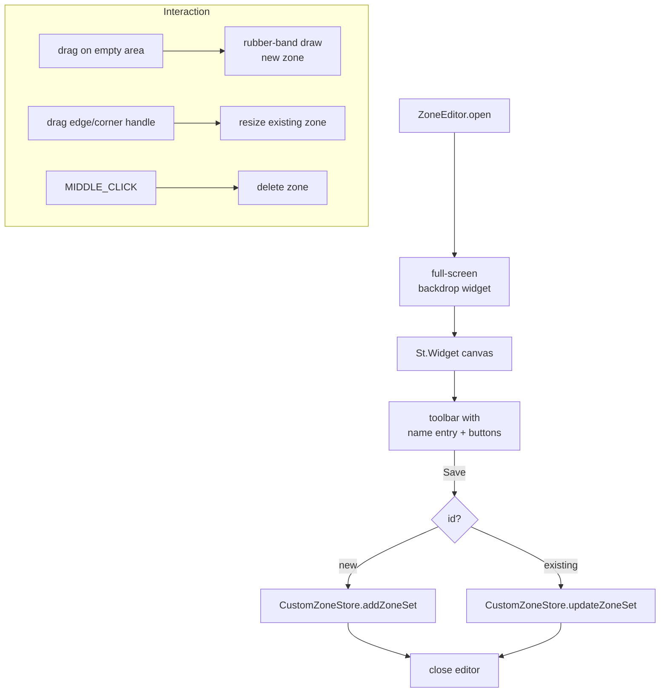

All coordinates snap to a configurable grid (default **12 columns × 8 rows**, range 4–24 / 4–16). The minimum zone size is 40 px. Handle hit areas include **+8 px padding** for easier targeting.

#### GNOME 47+ Compatibility

- `captured-event` signal was removed in GNOME 47. The editor uses a try/catch fallback: first attempts `this._backdrop.grab()` + event handler, falls back to `captured-event` on `global.stage`.
- `event.get_source()` was removed in GNOME 47. Zone/handle hit-testing uses coordinate-based `_findHandleAt(px, py)` and `_findZoneAt(px, py)` instead of relying on the event source actor.
- The `grab()` return value is null-checked before storing (may return null on some GNOME versions).

---

### Maximize Button Hook

**Module:** `src/maximizeHook.js`

Intercepts the maximize button to show the Snap Layout Overlay instead of actually maximizing.

**Technique:** Listens for `size-changed` on `global.window_manager`. When a window transitions to `Meta.MaximizeFlags.BOTH`, it:

1. Checks the window is not in the `_bypassed` set (programmatic maximizes from `snapFocusedUp` are excluded)
2. Checks the window is not in `_recentlyCreated` (avoids intercepting startup maximizes)
3. Unmaximizes immediately and opens the overlay

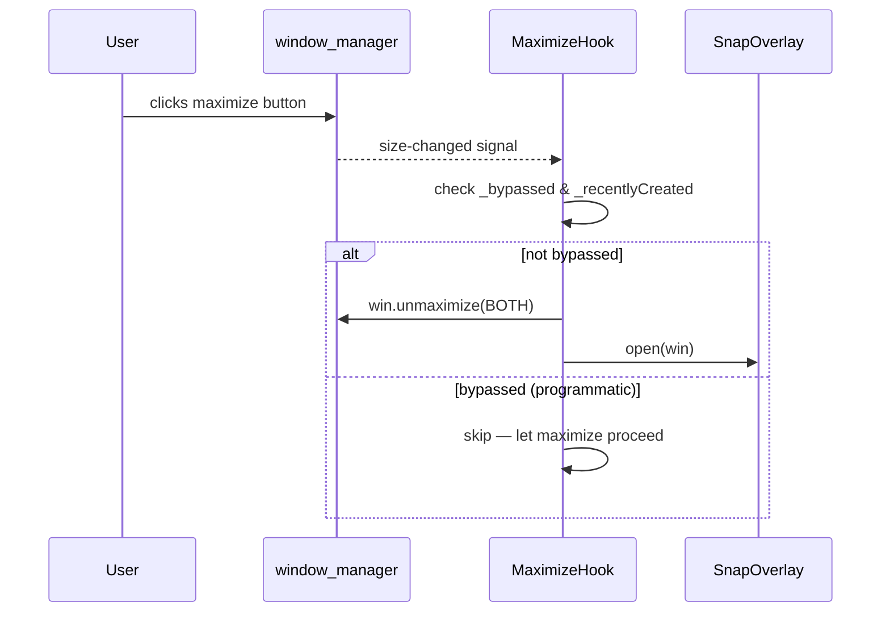

The `bypass(windowId)` method sets a ~500 ms exemption so `snapFocusedUp` can maximize without triggering the overlay.

---

### Keybindings

**Module:** `src/keybindings.js`

All keybindings are registered via `Main.wm.addKeybinding` against the `window-tiling-control.keybindings` GSettings child schema. They are user-configurable in the preferences UI, organized into six groups.

#### Window Tiling (Super + direction)

| Default Key | Action |
|-------------|--------|
| `Super+Left` | Snap left half / navigate quarter left |
| `Super+Right` | Snap right half / navigate quarter right |
| `Super+Up` | Snap upper quarter / navigate quarter up |
| `Super+Down` | Snap lower quarter / navigate quarter down |

#### Direct Quarter Placement (Super + U/I/J/K)

| Default Key | Action |
|-------------|--------|
| `Super+U` | Snap to top-left quarter |
| `Super+I` | Snap to top-right quarter |
| `Super+J` | Snap to bottom-left quarter |
| `Super+K` | Snap to bottom-right quarter |

#### Move / Swap (Super+Shift + direction)

| Default Key | Action |
|-------------|--------|
| `Super+Shift+Left` | Move/swap window left |
| `Super+Shift+Right` | Move/swap window right |
| `Super+Shift+Up` | Move/swap window up |
| `Super+Shift+Down` | Move/swap window down |

#### Focus & Auto-Tile

| Default Key | Action |
|-------------|--------|
| `Super+Tab` | Cycle focus between tiled windows |
| `Super+T` | Auto-tile all visible windows into active grid |

#### Monitor Movement (Super+Ctrl + direction)

| Default Key | Action |
|-------------|--------|
| `Super+Ctrl+Left` | Move window to left monitor |
| `Super+Ctrl+Right` | Move window to right monitor |

#### Layout & Overlay

| Default Key | Action |
|-------------|--------|
| `Super+Z` | Open Snap Layout Overlay |
| `Super+E` | Open Zone Editor |
| `Super+]` | Cycle to next preset |
| `Super+[` | Cycle to previous preset |
| `Super+Shift+G` | Restore last snap group |

Six additional `snap-to-zone-N` keys (1–6) are available but unbound by default.

#### GNOME Native Tiling Override

On `enable()`, WindowTilingControl disables conflicting GNOME native tiling:

- `org.gnome.mutter` → `edge-tiling` set to `false`
- `org.gnome.desktop.wm.keybindings` → `maximize` and `unmaximize` cleared
- `org.gnome.mutter.keybindings` → `toggle-tiled-left` and `toggle-tiled-right` cleared

All original values are saved and restored on `disable()`.

**Context-aware navigation (quarters ↔ halves):**

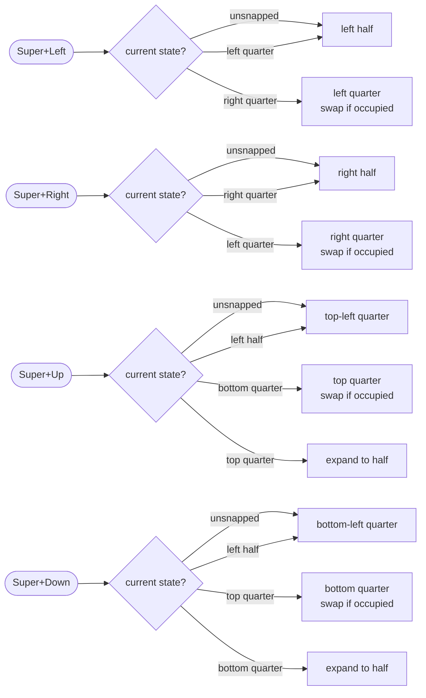

---

### Multi-Monitor Support

**Module:** `src/multiMonitor.js`

`MultiMonitorManager` maintains a `MonitorInfo` record for each display (index, aspect ratio, is-ultra-wide, is-portrait, geometry, workarea). It rebuilds on `monitors-changed` and `workareas-changed` signals.

> **GNOME 46+ note:** The `monitors-changed` signal moved from `global.display` to `Meta.MonitorManager`. `MultiMonitorManager` tries `Meta.MonitorManager.get()` first and falls back to `global.display` for GNOME 45.

Each **monitor × workspace** pair has its own active preset, stored as a JSON map in GSettings so it persists across sessions.

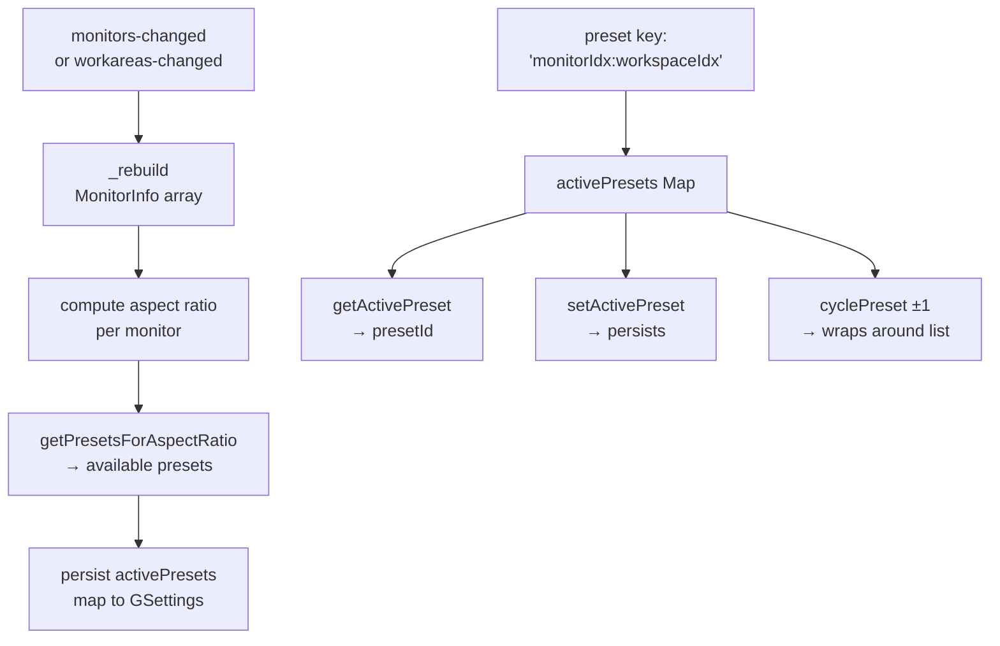

Cross-monitor window moves (`moveFocusedToMonitor`) use `findClosestZoneIndex` to place the window in the geometrically closest zone on the target monitor.

---

### Quick Settings Indicator

**Module:** `src/indicator.js`

Adds a **Window Tiling Control** toggle entry to the GNOME Quick Settings panel (the area opened by clicking the top-right corner). Uses the GNOME 43+ `QuickMenuToggle` API.

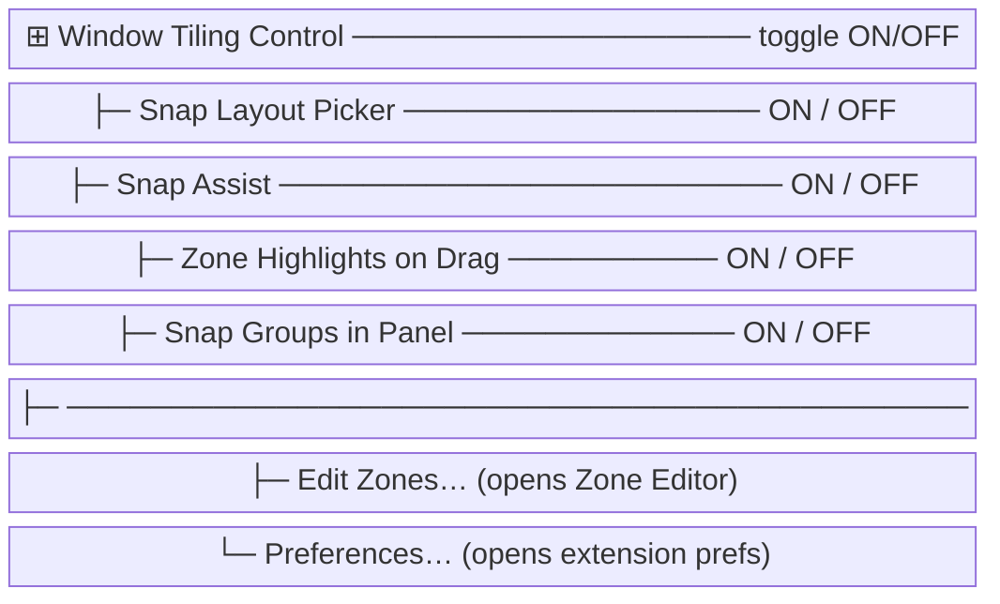

All toggles are bound directly to GSettings keys via `Gio.SettingsBindFlags.DEFAULT`, so changes take effect immediately without a restart.

The `disable()` method guards against already-disposed widgets with try/catch blocks, since GNOME may auto-destroy Quick Settings items when the panel is rebuilt or on the lock screen.

---

### Animations

**Module:** `src/animations.js`

Wraps Mutter's `actor.ease()` API with four speed levels:

| Level | Label | Duration |
|-------|-------|----------|
| 0 | Off | 0 ms (instant) |
| 1 | Fast | 100 ms |
| 2 | Normal (default) | 200 ms |
| 3 | Slow | 400 ms |

Provided effects: `fadeIn`, `fadeOut`, `slideIn`, `slideOut`, `easeRect` (window move/resize). All methods are null-safe and no-op when the actor is null.

---

## Module Reference

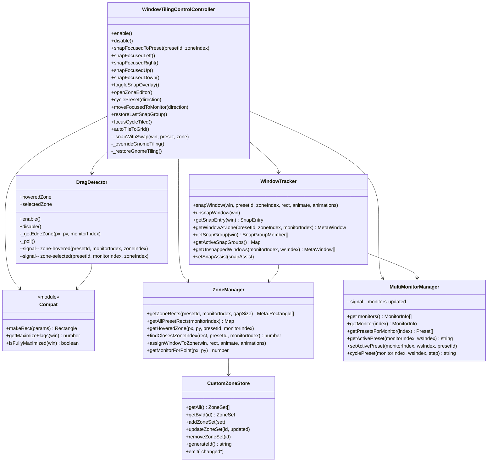

---

## Settings Reference

All settings live under the schema `org.gnome.shell.extensions.window-tiling-control`.

### Feature Toggles

| Key | Type | Default | Description |
|-----|------|---------|-------------|
| `tiling-enabled` | boolean | `true` | Master on/off switch |
| `snap-overlay-enabled` | boolean | `true` | Enable Super+Z overlay |
| `snap-assist-enabled` | boolean | `true` | Enable Snap Assist thumbnails |
| `drag-zone-highlight-enabled` | boolean | `true` | Highlight zones during drag |
| `snap-groups-enabled` | boolean | `true` | Track & restore snap groups |

### Numeric Tuning

| Key | Type | Default | Range | Description |
|-----|------|---------|-------|-------------|
| `window-gap-size` | uint | 4 | 0–40 | Gap in px around snapped windows |
| `drag-edge-threshold` | uint | 20 | 5–100 | Px from edge to trigger drag highlight |
| `snap-assist-timeout` | uint | 8 | 2–30 | Seconds before Snap Assist auto-closes |
| `animation-speed` | uint | 2 | 0–3 | 0=Off, 1=Fast, 2=Normal, 3=Slow |
| `zone-editor-grid-columns` | uint | 12 | 4–24 | Zone editor snap grid columns |
| `zone-editor-grid-rows` | uint | 8 | 4–16 | Zone editor snap grid rows |
| `log-level` | uint | 0 | 0–4 | 0=Off, 4=Debug |

### Appearance

| Key | Type | Default | Description |
|-----|------|---------|-------------|
| `overlay-position` | string | `'top-center'` | `'top-center'` or `'top-right'` |
| `zone-highlight-color` | string | `'rgba(0,120,212,0.25)'` | Fill color for inactive zones |
| `zone-border-color` | string | `'rgba(0,120,212,0.9)'` | Border/active zone color |

### Persisted State

| Key | Type | Description |
|-----|------|-------------|
| `custom-zone-sets` | string[] | JSON-serialized custom zone layouts |
| `monitor-presets` | string[] | JSON-serialized per-monitor/workspace preset map |

### Keybindings (child schema `…window-tiling-control.keybindings`)

| Key | Default |
|-----|---------|
| `snap-left-half` | `<Super>Left` |
| `snap-right-half` | `<Super>Right` |
| `snap-upper-quarter` | `<Super>Up` |
| `snap-lower-quarter` | `<Super>Down` |
| `snap-top-left` | `<Super>u` |
| `snap-top-right` | `<Super>i` |
| `snap-bottom-left` | `<Super>j` |
| `snap-bottom-right` | `<Super>k` |
| `move-swap-left` | `<Super><Shift>Left` |
| `move-swap-right` | `<Super><Shift>Right` |
| `move-swap-up` | `<Super><Shift>Up` |
| `move-swap-down` | `<Super><Shift>Down` |
| `focus-cycle-tiled` | `<Super>Tab` |
| `auto-tile-grid` | `<Super>t` |
| `move-monitor-left` | `<Super><Primary>Left` |
| `move-monitor-right` | `<Super><Primary>Right` |
| `open-snap-overlay` | `<Super>z` |
| `open-zone-editor` | `<Super>e` |
| `cycle-preset-next` | `<Super>bracketright` |
| `cycle-preset-prev` | `<Super>bracketleft` |
| `restore-snap-group` | `<Super><Shift>g` |
| `snap-to-zone-1` … `6` | *(unbound)* |

---

## Extension Lifecycle

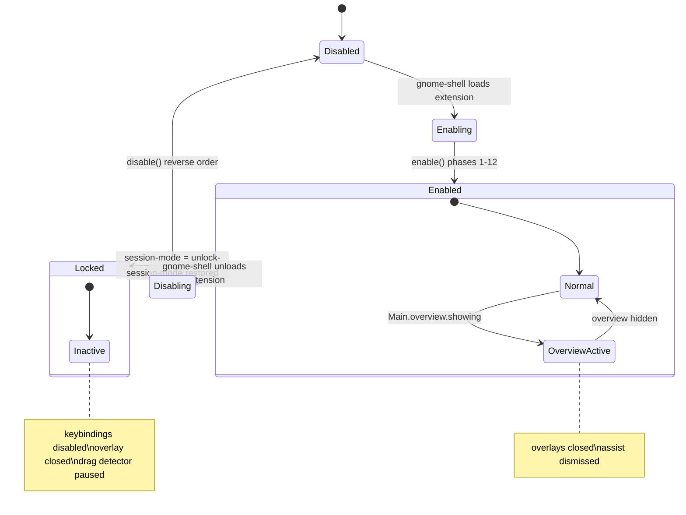

---

## Test Architecture

Tests use Node.js's built-in `node:test` runner with a custom ESM loader hook to stub all `gi://` and `resource:///` imports, enabling the pure-logic modules to run without a live GNOME Shell session.

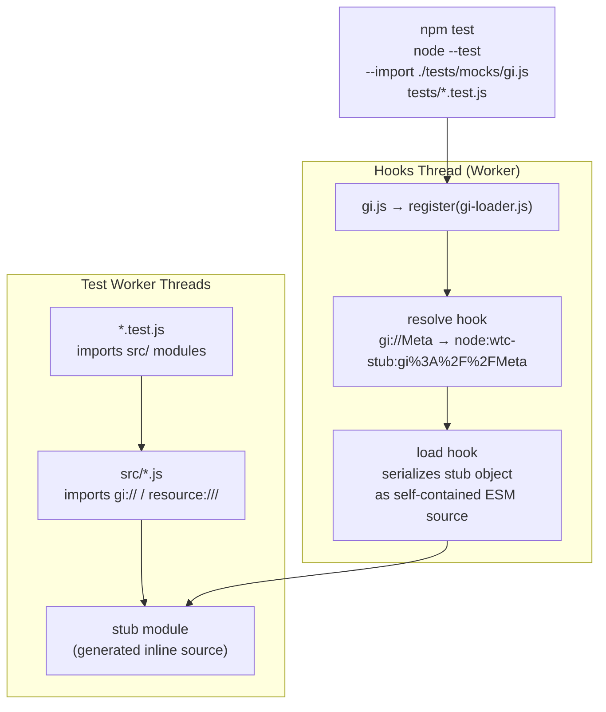

### Stub Strategy

- **`gi://GObject`** — `registerClass` pass-through, `GObject.Object` base class with signal emit/connect, `TYPE_*` constants
- **`gi://Meta`** — `Meta.Rectangle` data class, flag enums (`MaximizeFlags`, `GrabOp`, `DisplayDirection`)
- **`gi://GLib`** — async `timeout_add`/`idle_add` (resolved via `Promise.resolve()`), constants
- **`gi://Gio`** — `SettingsBindFlags` constants
- **`gi://Clutter`** — `AnimationMode`, `ActorAlign`, `EventType` enums
- **UI layers** (`St`, `Shell`, `Adw`, `Gtk`, `Gdk`, GNOME Shell resources) — empty `{}` stubs; tests that reach UI code will fail with a clean property-not-found error

### Test Files & Coverage

| Test File | Covers | Tests |
|-----------|--------|-------|
| `animations.test.js` | `fadeIn`, `fadeOut`, `slideIn`, `slideOut`, speed levels | 24 |
| `controller.test.js` | `WindowTilingControlController` enable/disable, snap methods, navigation | 35 |
| `customZones.test.js` | `CustomZoneStore` CRUD, signal emission, ID generation | 15 |
| `dragDetector.test.js` | Edge/corner detection, threshold clamping, grab-op compat, signal params | 19 |
| `i18n.test.js` | `_()` and `ngettext()` with/without extension object | 5 |
| `keybindings.test.js` | Binding registration, grouped shortcuts, enable/disable | 16 |
| `layoutPresets.test.js` | All 8 presets, aspect-ratio filtering, normalization | 16 |
| `logger.test.js` | Log levels, prefix, null-safety | 10 |
| `maximizeHook.test.js` | Bypass set, recently-created guard, intercept logic | 10 |
| `multiMonitor-signals.test.js` | GNOME 46+ `MonitorManager` signal compatibility | 3 |
| `multiMonitor.test.js` | Preset key composition, per-ws/monitor state, cycle, persistence | 13 |
| `snapAssist.test.js` | Thumbnail picker, zone filling, timeout, workspace change | 13 |
| `snapGroups.test.js` | Group tracking, panel button, signal cleanup | 10 |
| `snapOverlay.test.js` | Layout picker, keyboard nav, preset buttons | 18 |
| `windowTracker.test.js` | Snap/unsnap, group detection, `getWindowAtZone`, `getUnsnappedWindows` | 18 |
| `zoneEditor.test.js` | Drawing, handles, grid snap, GNOME 47+ compat | 19 |
| `zoneHighlight.test.js` | Overlay rendering, signal-driven updates | 17 |
| `zoneManager.test.js` | `_normToPixel`, `getZoneRects`, `getHoveredZone`, monitor lookup | 18 |
| **Total** | | **279** |

---

## Build & Install

```bash
# Install dev dependencies (Node.js ≥ 20 required)
npm install

# Run all 279 tests
npm test

# Watch mode
npm run test:watch

# Type-check without emitting
npm run typecheck

# Pack the extension zip (requires make + glib-compile-schemas)
make build

# Install to ~/.local/share/gnome-shell/extensions/
make install
```

After `make install`, enable with:

```bash
gnome-extensions enable window-tiling-control@gnome-tiling
```

or toggle via GNOME Extensions app / Extensions Manager.

**Compatible with GNOME Shell 45, 46, 47, 48, 49.**
